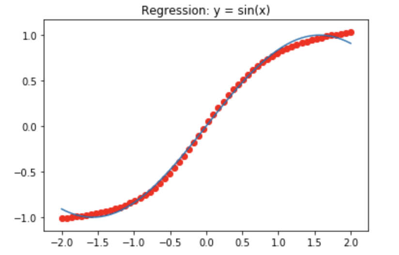

# 反向传播算法数学推导及代码实现

## 目录结构

+ 可变隐藏层 BackPropagation_include_math.ipynb
+ 简单实现 BackPropagation_simple_implement.ipynb
+ 数学推导 MathBP.ipynb
+ 数学推导 MathBP.pdf

## 拟合函数效果展示

### 损失函数

### 效果函数

### 数学推导

下面图片为截图，完整版见MathBP.pdf

